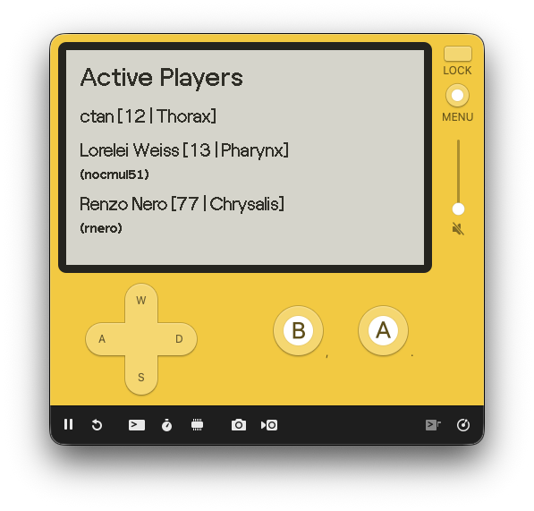

# CuddleKit Embedded Demo

This sample package demonstrates using CuddleKit it an embedded
environment. More specifically, this example builds and runs a
sample project for the [Playdate](https://play.date) game console.



## Building

**Required Tools**  
- swiftly
- Playdate SDK (https://play.date/dev)
- Just (https://just.systems)

Start by opening this project in a terminal window or in your
favorite code editor. To build the project, run `just build`.

Alternatively, run the following:

```bash
swiftly run swift package pdc --extra-device-o-files-build-dirs CKDL.build/src
```

If you want to run the project in the Playdate Simulator via Just, you
will need to link the Simulator executable to your PATH. For example:

```
ln -s ~/Developer/PlaydateSDK/bin/Playdate\ Simulator.app/Contents/MacOS/PlaydateSimulator ~/.local/bin/PlaydateSimulator

export PATH="$HOME/.local/bin:$PATH"
```
